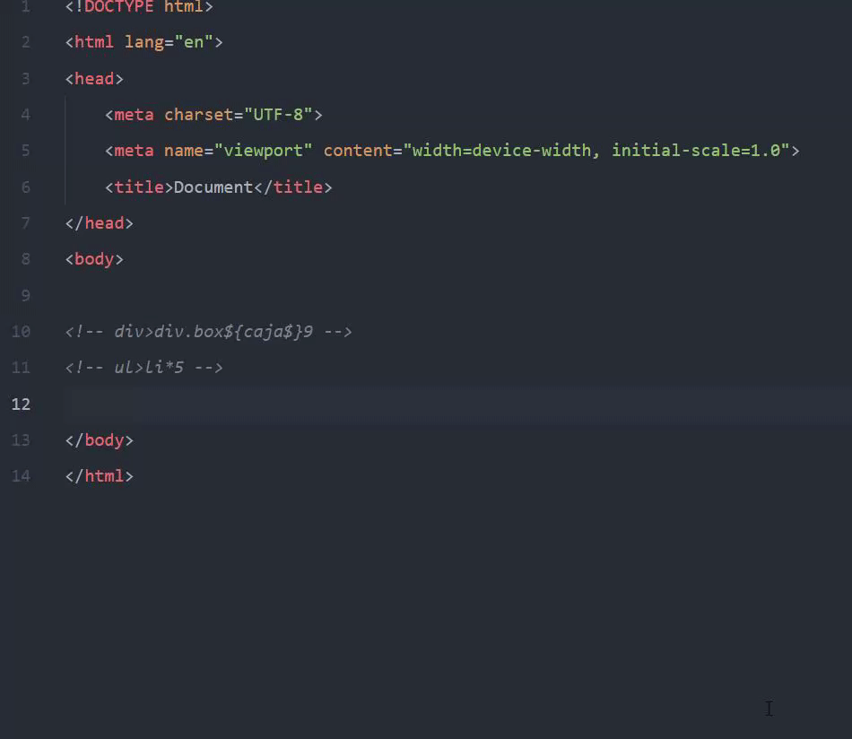
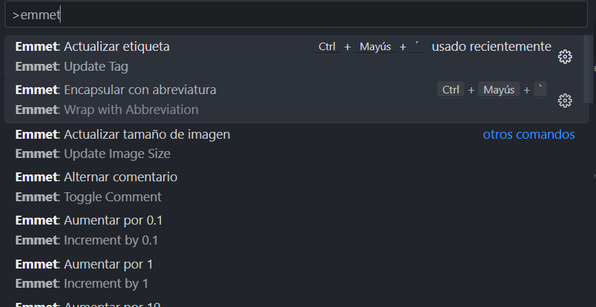
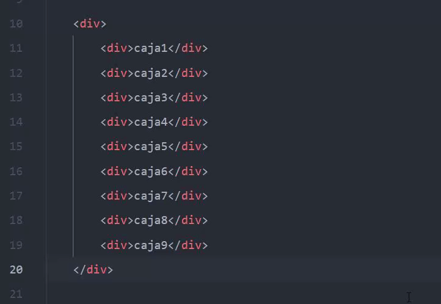
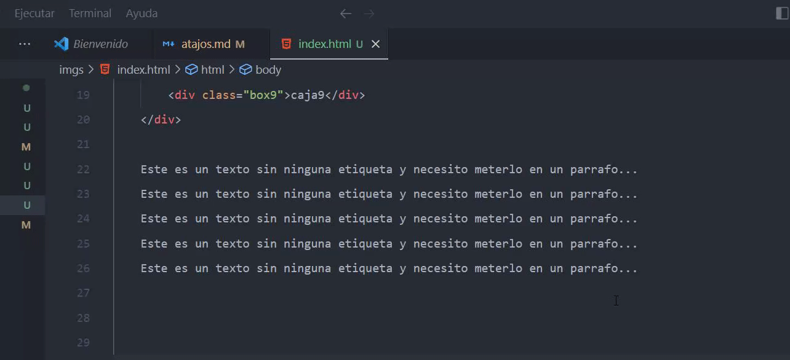
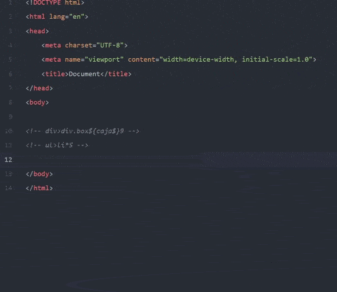
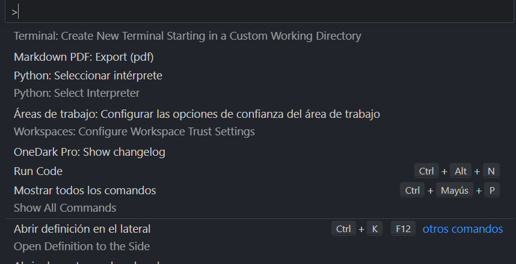
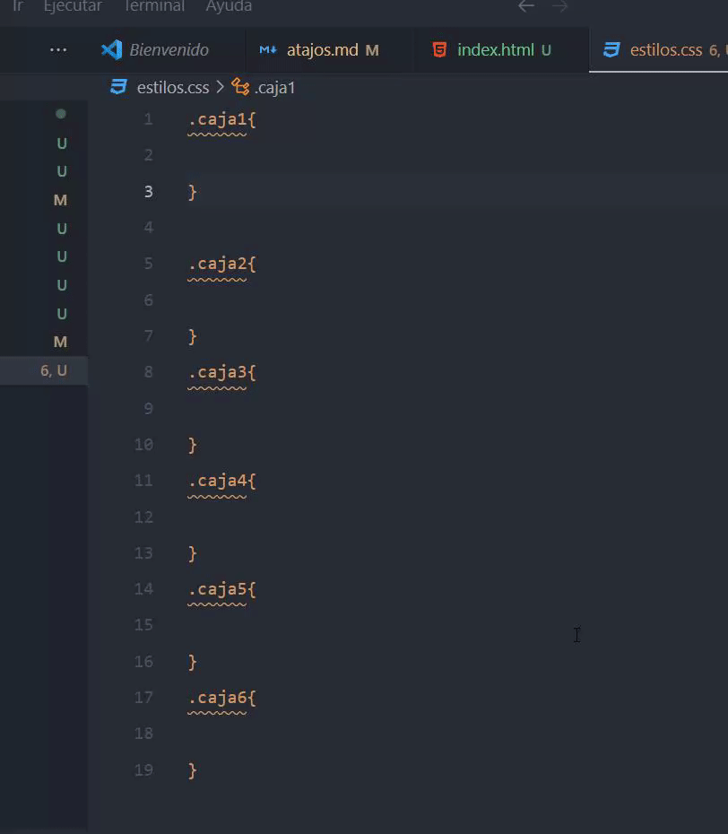
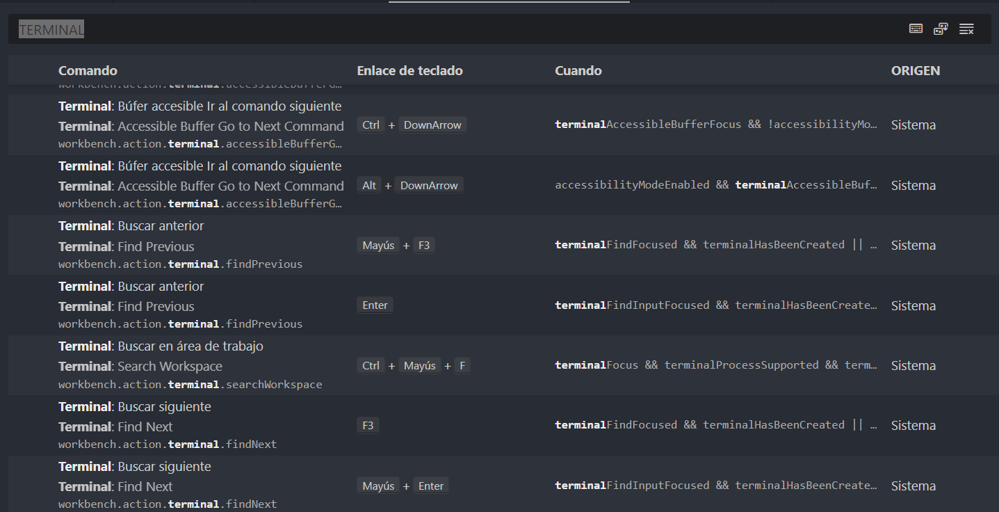

# Atajos de Visual Studio Code
Estos nos permitirán aumentar nuestra productividad y realizar tareas repetitivas mucho más rápido, aquí un ejemplo:

Estos pueden variar en función del OS que se este usando. Este documento se centra en comandos para Windows.

----
## Atajos Emmet
Los atajos emmet nos ayudarán a escribir y editar ``HTML`` y ``CSS`` más rápido.

### Editar etiquetas

Podemos usar ``CTRL+SHIFT+P`` para acceder al buscador, escribir ``EMMET`` y seleccionar atajos como: __encapsular etiqueta__. También se puede crear atajos propios para utilizar estas etiquetas. 

Podéis modificarlos dándole click a la rueda de ``SETTINGS``.

----
### Actualizar una etiqueta o varias etiquetas del mismo tipo

Seleccionamos la linea donde esta la etiqueta que queremos modificar, y pulsamos varias veces ``CTRL+D`` para ir seleccionando las etiquetas (del mismo nombre) que queramos modificar...

----
### Envolver texto plano o etiquetas

Seleccionamos el texto que queremos modificar, usamos el atajo personalizado o ``CTRL+SHIFT+P`` y buscamos 'actualizar etiqueta'. Después escribimos la nueva etiqueta en el buscador y presionamos ``ENTER``.

En mi caso yo accedo directamente al atajo mediante ``CTRL+SHIFT+´``.

----
### Crear varias etiquetas, estructuras personalizadas etc...

En la mayoria de combinaciones escribiremos la __etiqueta HTML__ seguida de algún ``SELECTOR DE CSS`` para hacer la combinación que necesitemos en su momento. 
    Algunos de estos selectores son:
* ``*``: Nos permite crear multiples etiquetas a la vez.
* ``>``: Nos permite incluir una etiqueta dentro de otra.
* ``+``: Nos permite crear varias etiquetas dentro de otra.
* ``.nombreClase``: Nos permite darle un nombre a ``CLASS="..."``.
* ``#nombreID``: Nos permite darle una ``ID`` a la etiqueta.
* ``$``: Nos permite crear un índice automático a la clase, id o contenido. Ejemplo: caja1,2,3,4,...
* ``{contenido}``: Nos permite escribir un contenido dentro de cada etiqueta.
* ``(etiquetas)``: Nos permite agrupar los atajos emmet para crear multiples etiquetas en una sección o grupo determinado.

----
### Ejemplo de divs

Sintaxis Emmet: ``div.contenedor>div.box${caja$}*9``

----
### Crear un elemento multiples veces

Sintaxis Emmet: ``elemento*N``

----
## Atajos configurables
Los atajos propios de ``VScode`` nos ayudarán a realizar ciertas tareas con mayor rapidez.

### Abrir el buscador
Podemos usar ``CTRL+SHIFT+P`` para abrirlo e introducir ciertas palabras clave para abrir las funcionalidades del editor más rápido, tales como: __abrir la terminal__, __activar 'X' funcion de una extensión que tengas instalada__ etc..

----
### Seleccionar texto y modificar varios apartados a la vez

Seleccionamos el texto y pulsamos ``CTRL+F2`` o ``CLICK DERECHO, SELECCIONAR TODAS LAS OCURRENCIAS`` y luego presionamos '<-' para desplazarnos por el código.

Nos sirve para cualquier lenguaje de programacion, html, css....

``BONUS``: Podemos usar otro atajo ``ALT+CLICK_IZQ`` en cualquier linea para poner le cursor en las líneas que elijamos.

----
## Atajos personalizados en VScode

Además de todos los atajos existentes, puedes modificarlos y añadir otros nuevos para practicamente cualquier funcionalidad de **VScode**. Por ejemplo:
* Puedes añadir un atajo para abrir una terminal dentro de VScode, de sistema...
* Puedes añadir un atajo para cerrar todas las terminales abiertas y minimizar su ventana.
* Puedes añadir seleccionar un texto y comentarlo/descomentarlo automáticamente.
* ETC...!

Para acceder a los ``ATAJOS`` y poder personalizarlos/buscarlos tienes que ir:
* ``RUEDA DE SETTINGS -> METODOS ABREVIADOS DEL TECLADO`` o ``CTRL+K SEGUIDO DE CTRL+S``. 

Después usar el buscador con palabras clave como ``CONSOLA``, ``TERMINAL``, ``BLOQUE``, ``LINEA`` etc...

----
